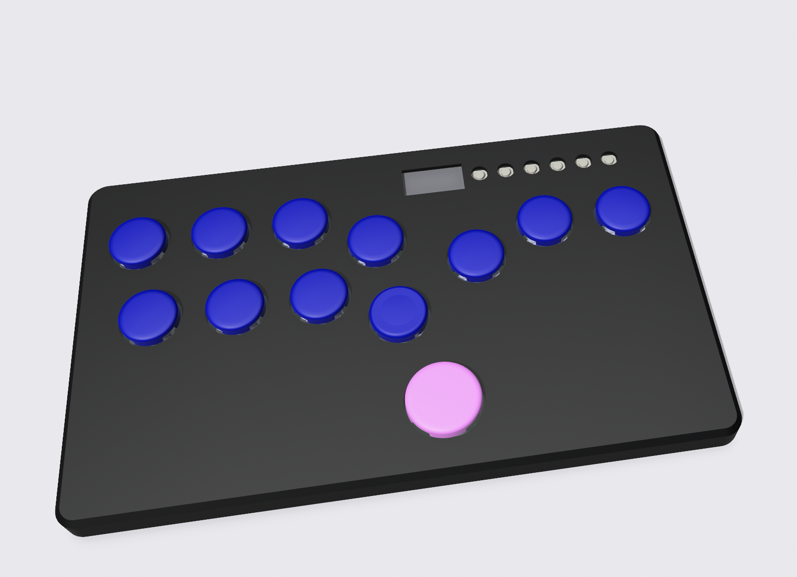
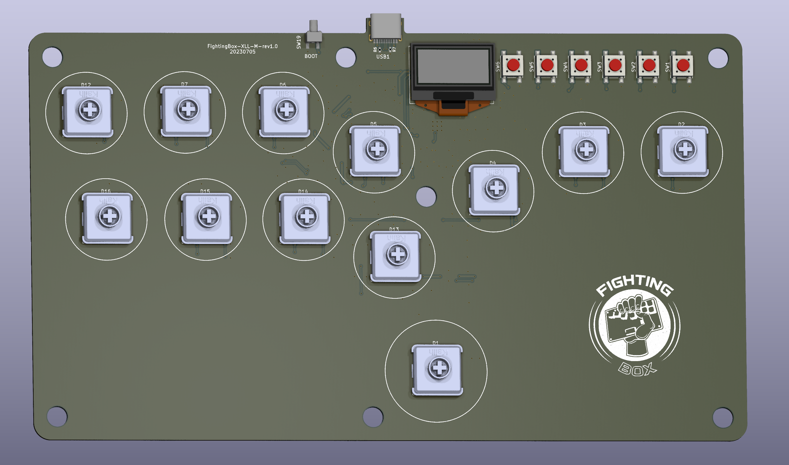

# Flatbox-LED-Mirrored
Based on the [GP2040-CE](https://github.com/OpenStickCommunity/GP2040-CE) Flatbox Rev4

Add the colorful LEDs and the OLED display, perfect hardware change beased on the [Flatbox](https://github.com/jfedor2/flatbox) design by [jfedor2](https://github.com/jfedor2) powered by an RP2040 MCU.

## Upgrade the firmware:
- Unplug your device.
- Put your device into Bootsel/USB mode. A new removable drive named RPI-RP2 should appear in your file explorer.
- Drag and drop the GP2040-CE_XXX.uf2 firmware into the removable drive.
- Wait for the device to automatically disconnect.

### If you encounter problems updating firmware, please refer to the official firmware update [Tutorial](https://gp2040-ce.info/?spm=a2g0o.detail.1000023.2.163cu936u936KZ#/installation).

## GP2040-CE Links

[Downloads](https://gp2040-ce.info/#/download) | [Installation](https://gp2040-ce.info/#/installation) | [Wiring](https://gp2040-ce.info/#/wiring) | [Usage](https://gp2040-ce.info/#/usage) | [FAQ](https://gp2040-ce.info/#/faq) | [GitHub](https://github.com/OpenStickCommunity/GP2040-CE)

Full documentation can be found at <https://gp2040-ce.info>

